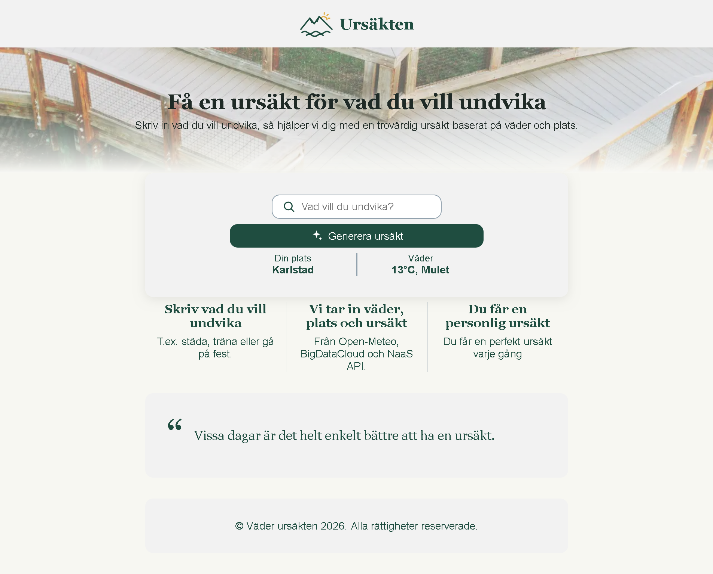
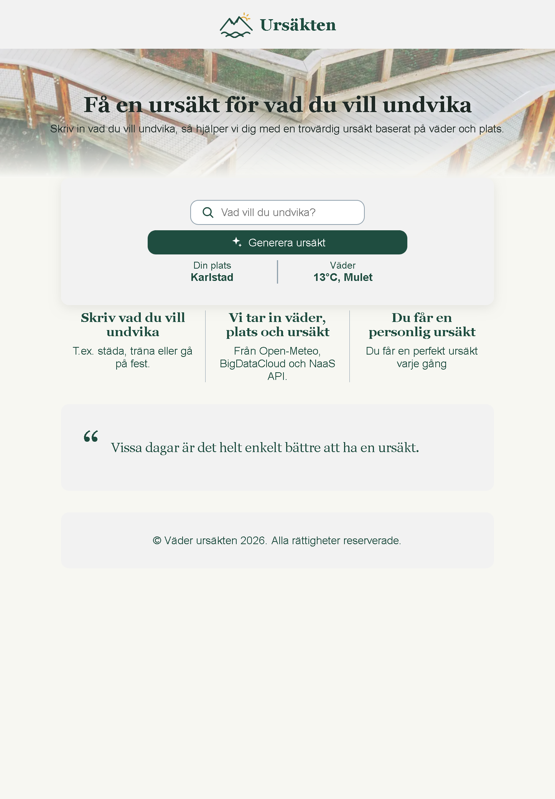
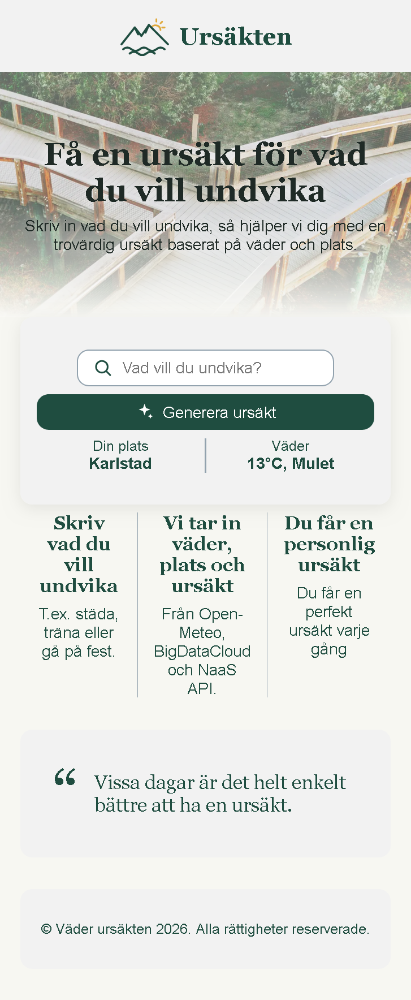
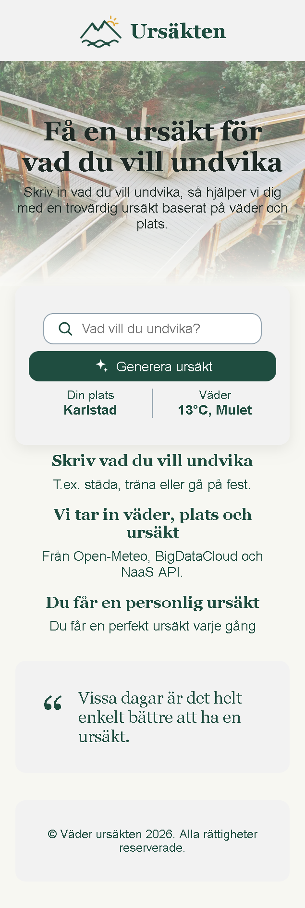
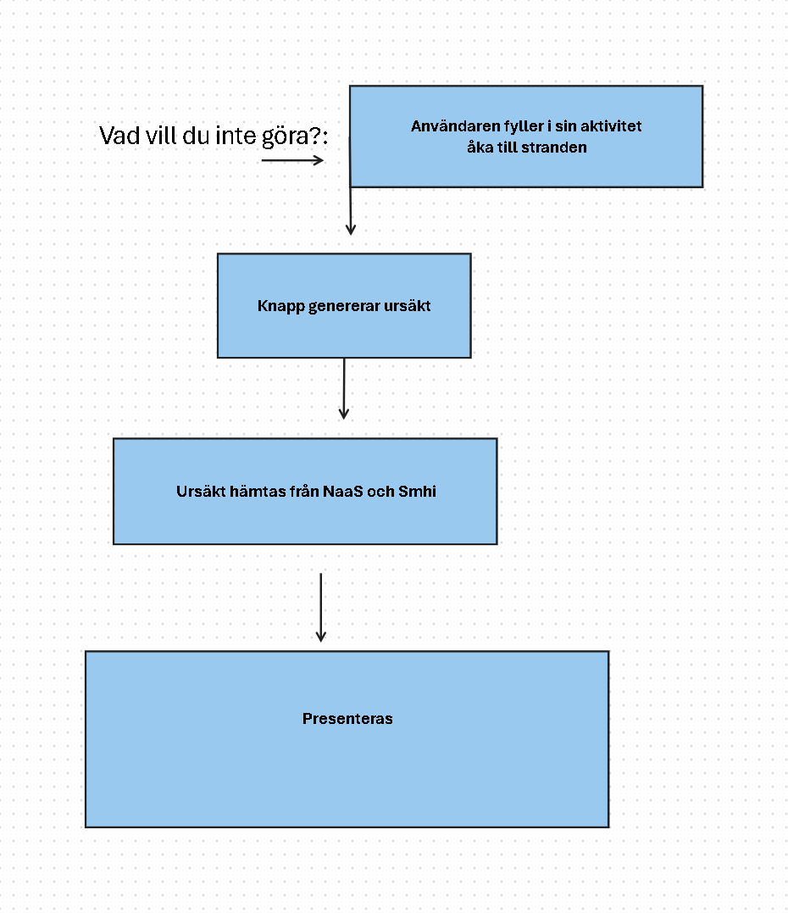
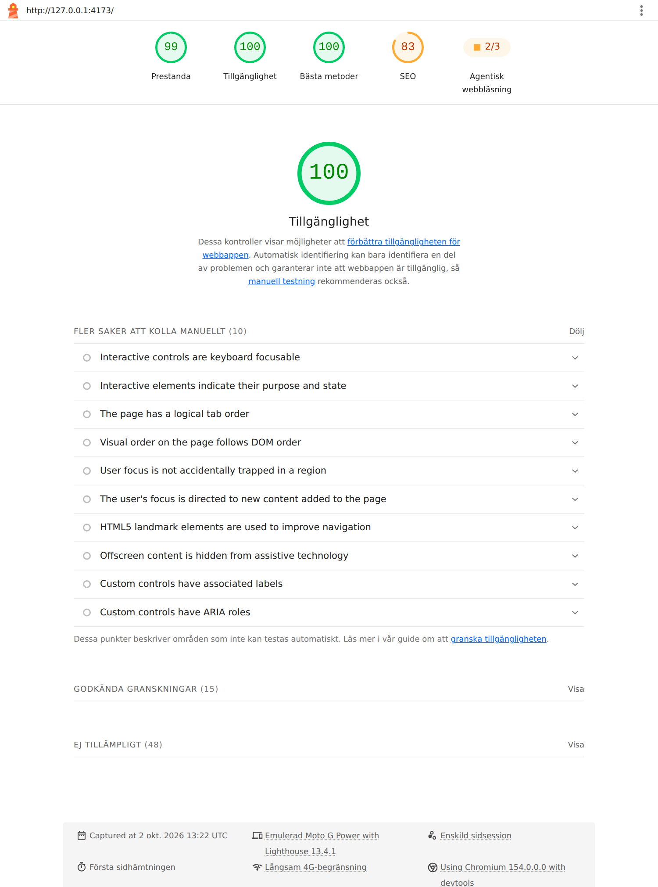
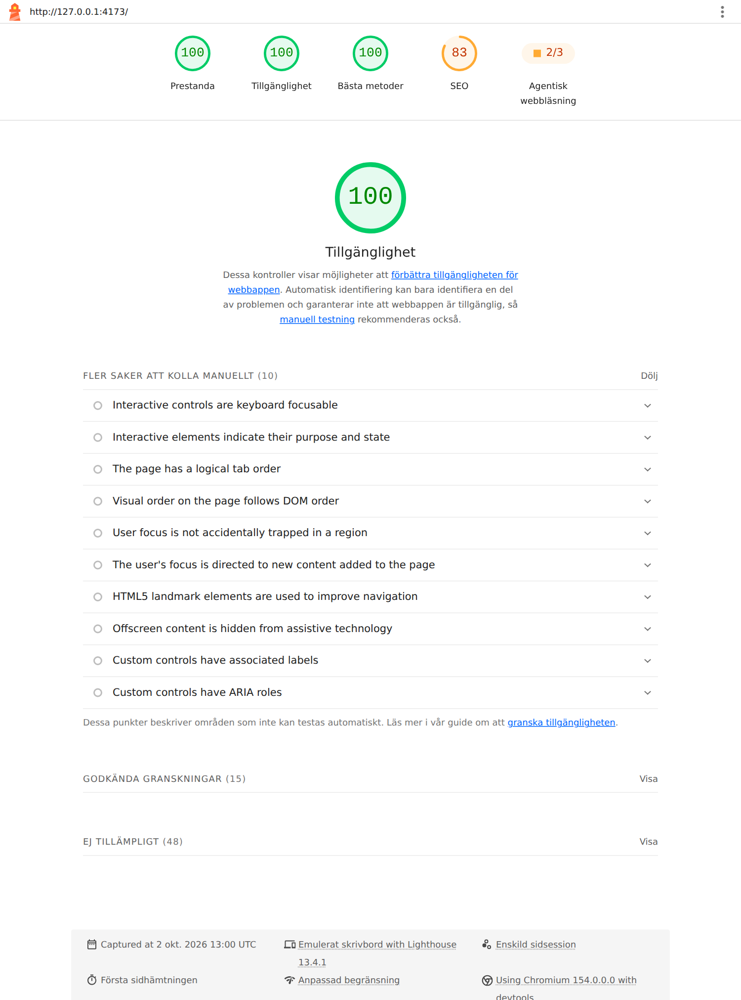
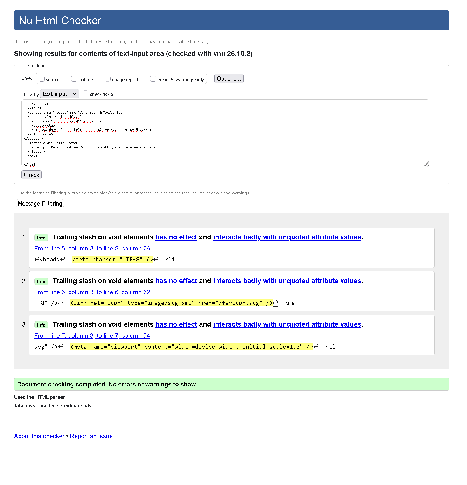
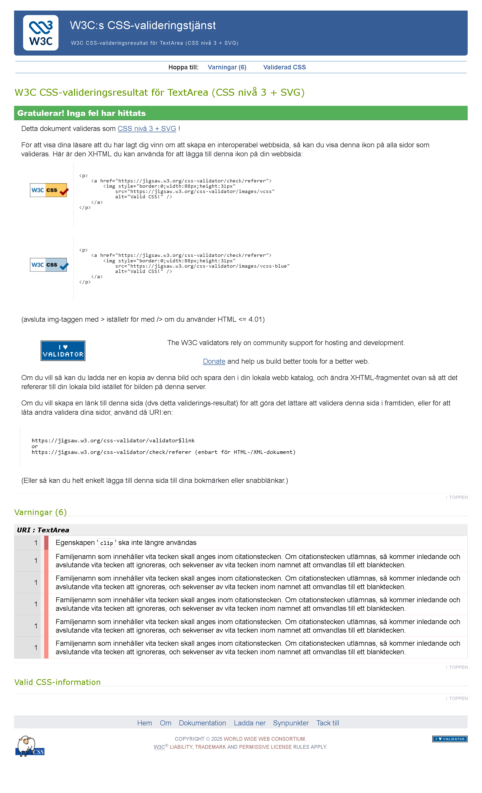

# Ursäkten

En webbapp som hjälper dig att slippa göra saker.

## Vad den gör

Skriv in vad du vill undvika. Appen hämtar en ursäkt från NaaS API och väderdata från Open-Meteo baserat på din plats, och kombinerar dem till ett personligt svar på varför du inte borde göra det.

## Skärmbilder

Sidan anpassar sig efter skärmens bredd. På de smalaste skärmarna ligger de tre stegen under varandra. Från 390 px ligger de bredvid varandra.

### Desktop, 1080 px



### Surfplatta och mobil

| Surfplatta, 820 px | Mobil, 412 px | Liten mobil, 360 px |
| --- | --- | --- |
|  |  |  |

## Byggd med

- HTML, CSS (Sass), JavaScript (Vanilla)
- Vite som byggverktyg
- API NaaS
- API Open Meteo
- API BigDataCloud

## Kom igång

Du behöver Node.js. Kör sedan det här i projektmappen:

```
npm install
npm run dev
```

Öppna adressen som visas i terminalen.

Vill du se den färdiga versionen, så som den byggs för publicering:

```
npm run build
npm run preview
```

## Wireframe



## Lighthouse

Testat med Lighthouse 13.4.1 i Chrome mot den byggda versionen.

### Mobil



### Desktop



## Validering

### HTML

Inga fel eller varningar i [Nu Html Checker](https://validator.w3.org/nu/).



### CSS

Inga fel och sex varningar i [W3C:s CSS-validerare](https://jigsaw.w3.org/css-validator/).



## Personuppgifter

Appen frågar efter din position för att visa väder och ort. Positionen skickas till två externa tjänster:

- **Open-Meteo**, för att hämta vädret.
- **BigDataCloud**, för att ta fram ortnamnet. BigDataCloud ser också din IP-adress.

Vi sparar ingenting. Nekar du positionen fungerar appen ändå, men utan väder och ort.

## Deltagare

- [Richard Lindqvist](https://github.com/lindqvistrl)
- [Elina Aspman](https://github.com/ElinaAspman)
- [Dennis Kvarnström](https://github.com/DEKV1)
- [Yanica Svensson](https://github.com/sweets86)